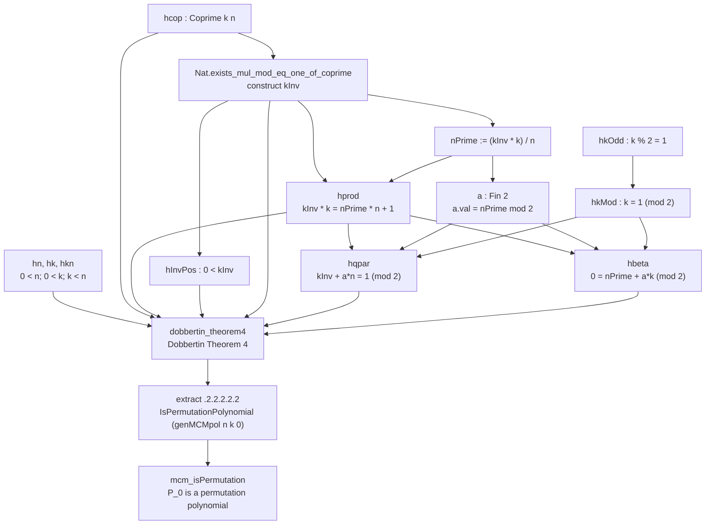
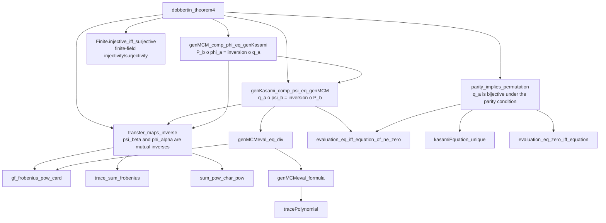
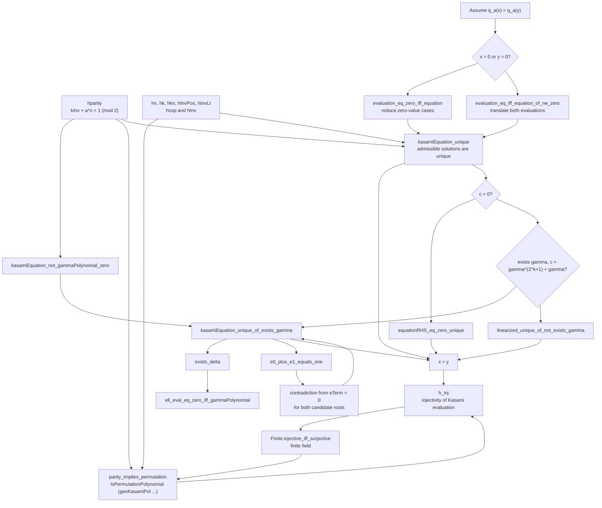

# Dependency Graph: `mcm_isPermutation`

This graph describes the proof of `GeneralizedKasami.mcm_isPermutation` in
[AristotleGPT56TerraNagyGP/RequestProject/genMCM.lean](AristotleGPT56TerraNagyGP/RequestProject/genMCM.lean).

The theorem specializes Dobbertin's Theorem 4 to `beta = 0`.  Its hypotheses
that `k` is odd and coprime to `n` are used to construct a modular inverse
`kInv`, the quotient `nPrime`, and a parity witness `a : Fin 2`.  Those data
supply the hypotheses of `dobbertin_theorem4`, from which the final MCM
permutation-polynomial component is extracted.

## Dependencies of `dobbertin_theorem4`

## How `parity_implies_permutation` Proves Kasami Bijectivity

The odd-parity hypothesis is the mechanism that rules out a zero value of
the auxiliary gamma polynomial.  This permits uniqueness of each admissible
Kasami-equation fiber.  The lemma first proves injectivity of the Kasami
evaluation map, then converts injectivity to bijectivity because `GF(2^n)` is
finite.

## Source Map

- The target theorem and the transfer-map/MCM identities are in [AristotleGPT56TerraNagyGP/RequestProject/genMCM.lean](AristotleGPT56TerraNagyGP/RequestProject/genMCM.lean).
- The Kasami permutation branch is in [AristotleGPT56TerraNagyGP/RequestProject/genkasamipol.lean](AristotleGPT56TerraNagyGP/RequestProject/genkasamipol.lean): `parity_implies_permutation` reduces injectivity to `kasamiEquation_unique`; the new third diagram expands this proof.
- Field and trace identities, including `evaluation_eq_iff_equation_of_ne_zero`, `trace_sum_frobenius`, and `gf_frobenius_pow_card`, are in [AristotleGPT56TerraNagyGP/RequestProject/basic.lean](AristotleGPT56TerraNagyGP/RequestProject/basic.lean).
- The modular-inverse existence theorem, parity arithmetic, finite-function equivalences, and characteristic-power sum lemma are from Mathlib.

The first diagram tracks the actual specialization proof.  The second expands the principal theorem call enough to show why the result ultimately rests on the Kasami permutation argument and Frobenius/trace algebra, without reproducing every internal calculation in the long transfer-map proof.
