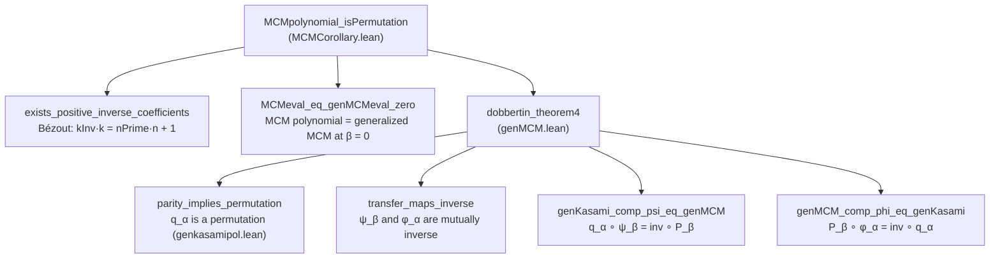
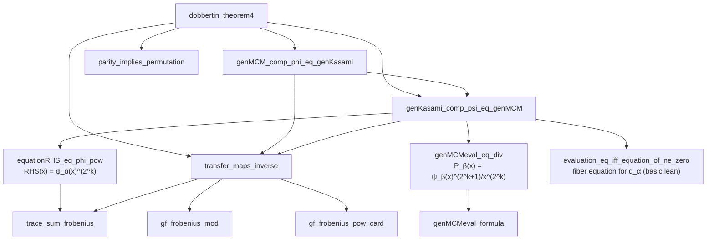
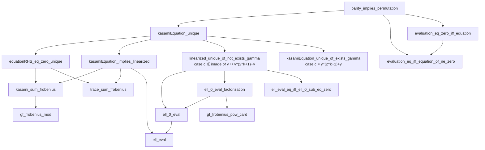
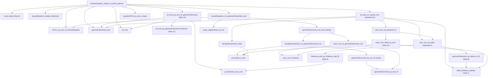
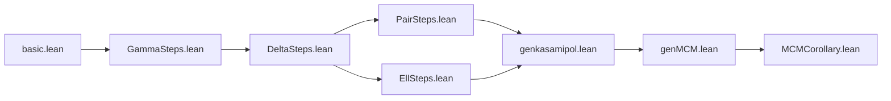

# Dependency graph of `MCMpolynomial_isPermutation`

This document records the complete dependency structure of the proof of

```lean
theorem MCMpolynomial_isPermutation
    (n k : ℕ) (hn : 0 < n) (hk : 0 < k) (hkn : k < n)
    (hcop : Nat.Coprime k n) (hkodd : Odd k) :
    IsPermutationPolynomial (MCMpolynomial n k)
```

in `RequestProject/MCMCorollary.lean`.

The graph was extracted from the elaborated proof terms: for each declaration
the constants actually occurring in its statement and proof were collected and
restricted to declarations of this project (auto-generated internal auxiliary
declarations such as `..._proof_1_2` were spliced out and replaced by their own
dependencies). So every edge below is a dependency that really occurs in the
kernel-checked proof, and every project declaration reachable from the main
theorem appears.

---

## 1. Definitions used in the statements

These are the definitions (not proofs) that the whole development is phrased
in terms of.

| Definition | File | Meaning |
|---|---|---|
| `GF n` | `RequestProject/basic.lean` | the field `GaloisField 2 n = GF(2^n)` |
| `IsPermutationPolynomial p` | `RequestProject/basic.lean` | `Function.Bijective p.eval` |
| `tracePolynomial n` | `RequestProject/basic.lean` | `∑_{i<n} X^(2^i)`, the absolute trace |
| `genKasamiPol n k kInv a` | `RequestProject/basic.lean` | generalized Kasami polynomial `q_α` |
| `genKasamiEval n k kInv a` | `RequestProject/basic.lean` | its evaluation map on `GF(2^n)` |
| `equationRHS n k kInv a z` | `RequestProject/basic.lean` | `∑_{i=1}^{kInv} z^(2^(ik)) + α·Tr(z)` |
| `ell n k c` | `RequestProject/basic.lean` | affine linearized polynomial `c^(2^k)X^(2^(2k)) + X^(2^k) + cX + 1` |
| `ell_0 n k c` | `RequestProject/basic.lean` | its homogeneous part `ell + 1` |
| `gammaCoefficient n k γ` | `RequestProject/GammaSteps.lean` | `c = γ^(2^k+1) + γ` |
| `gammaPolynomial n k γ` | `RequestProject/GammaSteps.lean` | `Q(X) = c X^(2^k) + γ² X + γ` |
| `iteratedKasamiSum n k kInv z` | `RequestProject/GammaSteps.lean` | `∑_{i<kInv} z^(2^((i+1)k))` |
| `IsDelta n k γ Δ` | `RequestProject/DeltaSteps.lean` | `(Δ^(2^k−1))⁻¹ = γ^(2^k−1) + γ⁻¹` |
| `eTerm n k kInv a γ x` | `RequestProject/PairSteps.lean` | the expression `e_j` of the paper |
| `genMCMpol n k b` | `RequestProject/genMCM.lean` | generalized MCM polynomial `P_β` |
| `genMCMeval n k b` | `RequestProject/genMCM.lean` | its evaluation map |
| `psi_beta n k b` | `RequestProject/genMCM.lean` | transfer linear map `ψ_β` |
| `phi_alpha n k kInv a` | `RequestProject/genMCM.lean` | transfer linear map `φ_α` |
| `MCMpolynomial n k` | `RequestProject/MCMCorollary.lean` | `X · (∑_{i<k} X^(2^i−1))^(2^k+1)` |
| `MCMeval n k` | `RequestProject/MCMCorollary.lean` | its evaluation map |

---

## 2. Top-level structure



Reading of the top level: coprimality gives a positive inverse `kInv < n` of
`k` mod `n` together with the Bézout quotient `nPrime`, i.e.
`kInv * k = nPrime * n + 1` (`exists_positive_inverse_coefficients`).
Theorem 4 is then applied with `α = nPrime mod 2` and `β = 0`; the oddness of
`k` is exactly what makes its two parity side conditions
(`kInv + α·n ≡ 1 [MOD 2]` and `β ≡ nPrime + α·k [MOD 2]`) hold. Theorem 4
yields that `genMCMpol n k 0` is a permutation polynomial, and
`MCMeval_eq_genMCMeval_zero` identifies the evaluation map of the displayed MCM
polynomial with that of `genMCMpol n k 0`, which finishes the proof.

---

## 3. The Dobbertin transfer branch (`genMCM.lean`)



---

## 4. The permutation branch (`genkasamipol.lean`, `basic.lean`)



---

## 5. The case `c = γ^(2^k+1) + γ` (Steps 6–12)



---

## 6. Complete edge list

Direct dependencies between proofs (definitions of Section 1 omitted).
Leaves are proofs that use no other project lemma.

| Lemma / theorem | File | Direct proof dependencies |
|---|---|---|
| `MCMpolynomial_isPermutation` | `MCMCorollary.lean` | `exists_positive_inverse_coefficients`, `MCMeval_eq_genMCMeval_zero`, `dobbertin_theorem4` |
| `exists_positive_inverse_coefficients` | `MCMCorollary.lean` | — |
| `MCMeval_eq_genMCMeval_zero` | `MCMCorollary.lean` | — |
| `dobbertin_theorem4` | `genMCM.lean` | `transfer_maps_inverse`, `genKasami_comp_psi_eq_genMCM`, `genMCM_comp_phi_eq_genKasami`, `parity_implies_permutation` |
| `genMCM_comp_phi_eq_genKasami` | `genMCM.lean` | `genKasami_comp_psi_eq_genMCM`, `transfer_maps_inverse` |
| `genKasami_comp_psi_eq_genMCM` | `genMCM.lean` | `transfer_maps_inverse`, `equationRHS_eq_phi_pow`, `genMCMeval_eq_div`, `evaluation_eq_iff_equation_of_ne_zero` |
| `transfer_maps_inverse` | `genMCM.lean` | `gf_frobenius_mod`, `gf_frobenius_pow_card`, `trace_sum_frobenius` |
| `equationRHS_eq_phi_pow` | `genMCM.lean` | `trace_sum_frobenius` |
| `genMCMeval_eq_div` | `genMCM.lean` | `genMCMeval_formula` |
| `genMCMeval_formula` | `genMCM.lean` | — |
| `parity_implies_permutation` | `genkasamipol.lean` | `kasamiEquation_unique`, `evaluation_eq_iff_equation_of_ne_zero`, `evaluation_eq_zero_iff_equation` |
| `kasamiEquation_unique` | `genkasamipol.lean` | `equationRHS_eq_zero_unique`, `kasamiEquation_implies_linearized`, `kasamiEquation_unique_of_exists_gamma`, `linearized_unique_of_not_exists_gamma` |
| `kasamiEquation_unique_of_exists_gamma` | `genkasamipol.lean` | `exists_delta`, `kasamiEquation_implies_linearized`, `ell_eval_eq_zero_iff_gammaPolynomial`, `kasamiEquation_not_gammaPolynomial_zero`, `e0_plus_e1_equals_one`, `eTerm_eq_zero_of_kasamiEquation`, `equationRHS_eq_zero_unique`, `gammaPolynomial_eval`, `ell_eval` |
| `kasamiEquation_not_gammaPolynomial_zero` | `genkasamipol.lean` | `gammaPolynomial_root_final_identity`, `eTerm_eq_zero_of_kasamiEquation`, `parity_algebraMap_eq_one` |
| `eTerm_eq_zero_of_kasamiEquation` | `genkasamipol.lean` | — |
| `parity_algebraMap_eq_one` | `genkasamipol.lean` | — |
| `e0_plus_e1_equals_one` | `PairSteps.lean` | `pair_sum_eq_delta`, `pair_trace_eq`, `iteratedKasamiSum_delta`, `delta_frobenius_identity`, `gammaPolynomial_eval` |
| `pair_trace_eq` | `PairSteps.lean` | `pair_sum_eq_delta`, `trace_sum_delta_eq_zero` |
| `pair_sum_eq_delta` | `PairSteps.lean` | `gammaPolynomial_eq_delta_inv_iff`, `frobenius_add_eq_frobenius_add_iff` |
| `iteratedKasamiSum_delta` | `PairSteps.lean` | `gf_frobenius_mod` |
| `ell_eval_eq_zero_iff_gammaPolynomial` | `EllSteps.lean` | `ell_eval_eq_gammaPolynomial_frobenius`, `ell_eval`, `gammaPolynomial_eval`, `gf_frobenius_pow_card` |
| `ell_eval_eq_gammaPolynomial_frobenius` | `EllSteps.lean` | — |
| `exists_delta` | `DeltaSteps.lean` | — |
| `delta_frobenius_identity` | `DeltaSteps.lean` | — |
| `gammaPolynomial_eq_delta_inv_iff` | `DeltaSteps.lean` | `delta_frobenius_identity` |
| `frobenius_add_eq_frobenius_add_iff` | `DeltaSteps.lean` | `gf_frobenius_pow_card` |
| `trace_sum_delta_eq_zero` | `DeltaSteps.lean` | `delta_frobenius_identity`, `gf_frobenius_mod`, `trace_sum_frobenius` |
| `gammaPolynomial_root_final_identity` | `GammaSteps.lean` | `iteratedKasamiSum_of_gammaPolynomial_root`, `trace_sum_of_gammaPolynomial_root` |
| `iteratedKasamiSum_of_gammaPolynomial_root` | `GammaSteps.lean` | `gammaPolynomial_eq_zero_iff_iterate`, `gf_frobenius_mod` |
| `trace_sum_of_gammaPolynomial_root` | `GammaSteps.lean` | `gammaPolynomial_eq_zero_iff`, `trace_sum_frobenius` |
| `gammaPolynomial_eq_zero_iff_iterate` | `GammaSteps.lean` | `gammaPolynomial_eq_zero_iff` |
| `gammaPolynomial_eq_zero_iff` | `GammaSteps.lean` | — |
| `gammaPolynomial_eval` | `GammaSteps.lean` | — |
| `evaluation_eq_zero_iff_equation` | `basic.lean` | `evaluation_eq_iff_equation_of_ne_zero` |
| `evaluation_eq_iff_equation_of_ne_zero` | `basic.lean` | — |
| `equationRHS_eq_zero_unique` | `basic.lean` | `kasami_sum_frobenius`, `trace_sum_frobenius` |
| `kasamiEquation_implies_linearized` | `basic.lean` | `kasami_sum_frobenius`, `trace_sum_frobenius`, `ell_eval` |
| `linearized_unique_of_not_exists_gamma` | `basic.lean` | `ell_0_eval`, `ell_0_eval_factorization`, `ell_eval_eq_iff_ell_0_sub_eq_zero` |
| `ell_0_eval_factorization` | `basic.lean` | `ell_0_eval`, `gf_frobenius_pow_card` |
| `ell_eval_eq_iff_ell_0_sub_eq_zero` | `basic.lean` | — |
| `ell_0_eval` | `basic.lean` | `ell_eval` |
| `ell_eval` | `basic.lean` | — |
| `kasami_sum_frobenius` | `basic.lean` | `gf_frobenius_mod` |
| `trace_sum_frobenius` | `basic.lean` | — |
| `gf_frobenius_mod` | `basic.lean` | — |
| `gf_frobenius_pow_card` | `basic.lean` | — |

---

## 7. File-level dependency order



The main theorem is therefore supported by 65 project declarations
(19 definitions and 46 proofs). All of them are complete: the development
contains no `sorry`, and `MCMpolynomial_isPermutation` depends only on the
standard axioms `propext`, `Classical.choice`, `Quot.sound`.
