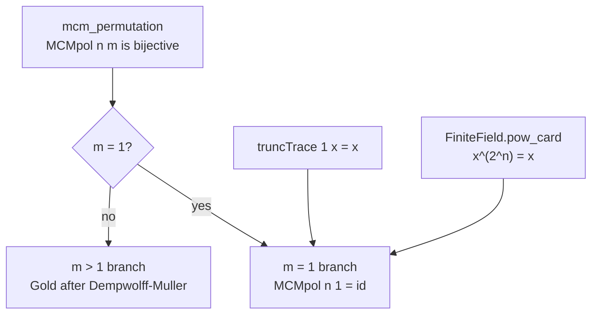
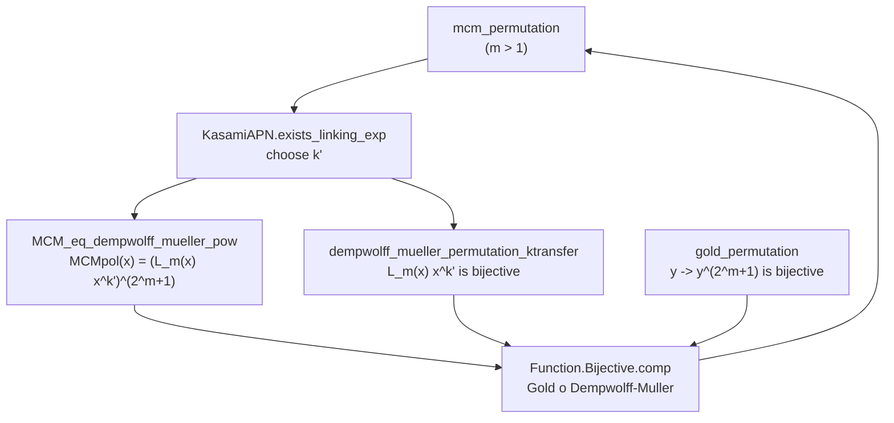
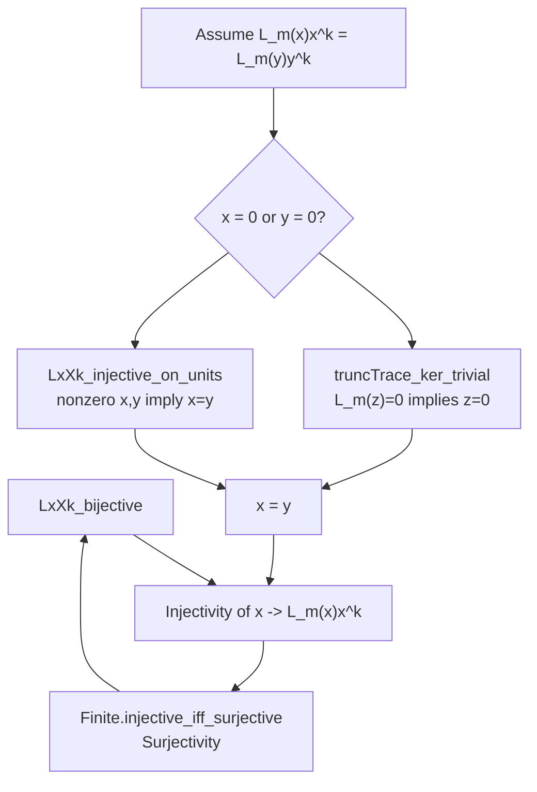
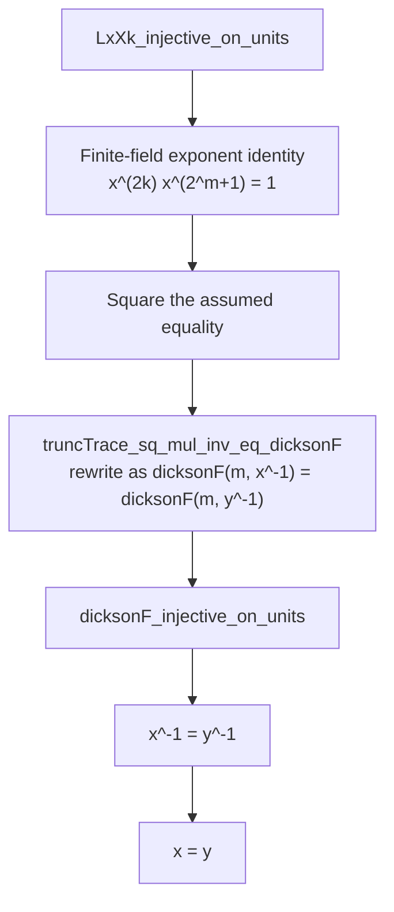
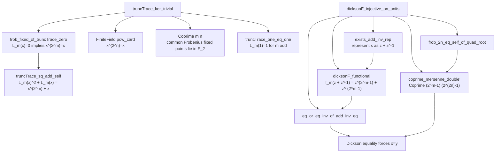
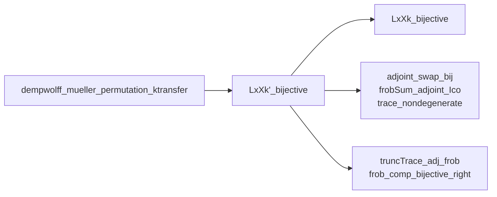

# Dependency Graph: `mcm_permutation`

This document describes the current proof of `Dobbertin1999.MCM.mcm_permutation`
in [Dobbertin1999MVP/Dobbertin1999/MCM.lean](Dobbertin1999MVP/Dobbertin1999/MCM.lean).

For $F = \mathbb{F}_{2^n}$, the implemented MCM polynomial is

$$
\operatorname{MCMpol}_{n,m}(x)
= L_m(x)^{2^m+1}x^{(2^n-1)-2^m},
\qquad
L_m(x)=\sum_{i=0}^{m-1}x^{2^i}.
$$

Thus it is the polynomial representative of
$L_m(x)^{2^m+1}/x^{2^m}$, including at $x=0$.  The theorem assumes
$0 < m < n$, both $m$ and $n$ odd, and $\gcd(m,n)=1$.

## Main Composition: $m > 1$

The proof obtains a linking exponent $k'$ with two modular properties.  One
property makes the Dempwolff-Muller map bijective; the other identifies the
MCM polynomial with its composition with the Gold power map.

The linking exponent carries these two congruences modulo $2^n-1$:

$$
k'(2^m+1) \equiv (2^n-1)-2^m,
$$

$$
(2^{n-1}-2^{m-1}-1)k' \equiv 2^{m-1}.
$$

The first is consumed by `MCM_eq_dempwolff_mueller_pow`; the second is
consumed by `dempwolff_mueller_permutation_ktransfer`.

## Dempwolff-Muller Core

The core theorem proves injectivity and obtains surjectivity from finiteness.
For injectivity it separates the zero and nonzero cases.  The zero cases use
triviality of the kernel of $L_m$; the nonzero case reduces equality of MCM
values to equality under a Dickson-like polynomial, whose restriction to the
units is injective.

## Unit Case and Dickson Reduction

## Support for the Two Main Reductions

## Dempwolff-Muller $k'$ Transfer

The MCM proof uses the transfer form, exposed as
`dempwolff_mueller_permutation_ktransfer`.  Its finite-field proof reduces back
to the canonical Dempwolff-Muller result `LxXk_bijective` using the
Frobenius-adjoint machinery.

## Source Map

- The project-level MCM wrapper is [Dobbertin1999MVP/Dobbertin1999/MCM.lean](Dobbertin1999MVP/Dobbertin1999/MCM.lean).
- The main argument, truncated-trace lemmas, Dickson reduction, and Theorem 3.2 are in [Dobbertin1999MVP/FiniteField/Thm32.lean](Dobbertin1999MVP/FiniteField/Thm32.lean).
- The $k'$ transfer-only adjoint facts come from [Dobbertin1999MVP/FiniteField/AdjointBij.lean](Dobbertin1999MVP/FiniteField/AdjointBij.lean), [Dobbertin1999MVP/FiniteField/FrobAlg.lean](Dobbertin1999MVP/FiniteField/FrobAlg.lean), and [Dobbertin1999MVP/FiniteField/TraceNorm.lean](Dobbertin1999MVP/FiniteField/TraceNorm.lean).
