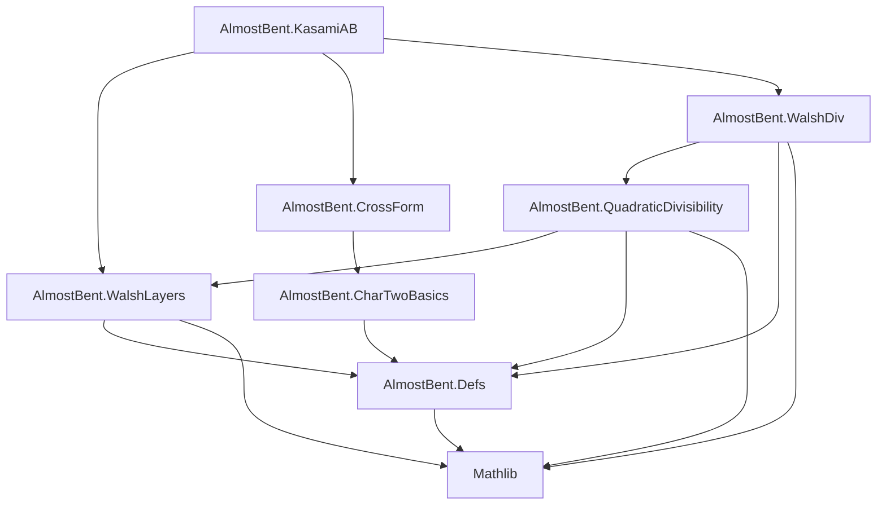
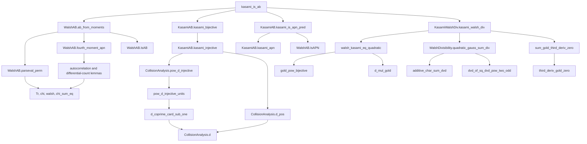

# Dependency Graph

This document records the dependency path for the project target
`KasamiAB.kasami_is_ab` as of 2026-07-23.

## Build Target

`lakefile.lean` declares the `AlmostBent` library as Lake's default target.
Its roots are:

```text
AlmostBent.Defs
AlmostBent.CharTwoBasics
AlmostBent.CrossForm
AlmostBent.QuadraticDivisibility
AlmostBent.WalshDiv
AlmostBent.WalshLayers
AlmostBent.KasamiAB
```

The main theorem is in `AlmostBent.KasamiAB`.

## Module Imports



`AlmostBent.KasamiAB` reaches every module needed by its proof through its
three direct imports: `WalshLayers`, `CrossForm`, and `WalshDiv`.

## Main Proof Dependencies



## Proof Obligations Supplied to `ab_from_moments`

`kasami_is_ab` applies the general lattice argument with three facts about
`x |-> x ^ d k`:

| Obligation | Theorem used |
| --- | --- |
| Walsh second moment | `parseval_perm`, using `kasami_bijective` |
| Walsh fourth moment | `fourth_moment_apn`, using `kasami_bijective` and `kasami_is_apn_pred` |
| Walsh divisibility | `KasamiWalshDiv.kasami_walsh_div` |

## Verification Caveat

`AlmostBent.KasamiAB.kasami_apn` is currently closed with `sorry`.
Consequently, `kasami_is_ab` compiles, but its APN branch is admitted rather
than proved in the current source tree.
